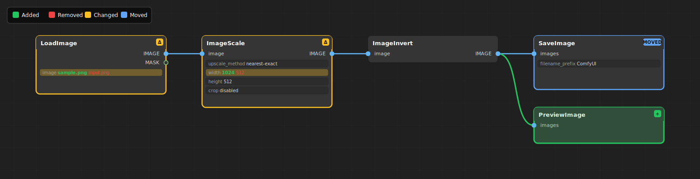

# comfyui-workflow-diff



ComfyUI custom node that adds two HTTP endpoints to your running ComfyUI server:

1. **`/workflow/diff`** — given two workflows, render a visual diff as an SVG
   image that shows **removed nodes in red**, **added nodes in green**,
   **changed widget rows highlighted in yellow**, and **moved nodes in blue**.
   The output mimics the look of the ComfyUI / litegraph frontend (dark
   background, rounded node bodies, slot-typed bezier links).
2. **`/workflow/convert`** — convert a "full" workflow (the JSON that ComfyUI
   produces from `Save`, complete with node positions/sizes/widget values) into
   the API/prompt format (`workflow_api.json`, what `Save (API)` produces and
   what `/prompt` accepts).

The converter is a fork of
[Seth Robinson's `comfyui-workflow-to-api-converter-endpoint`](https://github.com/SethRobinson/comfyui-workflow-to-api-converter-endpoint)
(see `LICENSE.upstream`). The diff renderer is original.

## Installation

```bash
cd ComfyUI/custom_nodes
git clone https://github.com/nat-chan/comfyui-workflow-diff
# restart ComfyUI
```

No Python dependencies. The diff endpoint always emits SVG (`image/svg+xml`),
which renders natively in browsers and can be converted to raster offline if
needed.

## Endpoints

### `POST /workflow/convert`

```bash
curl -s -X POST http://localhost:8188/workflow/convert \
  -H 'Content-Type: application/json' \
  --data-binary @workflow.json \
  > workflow_api.json
```

### `POST /workflow/diff`

Body:

```json
{
  "workflow_a":    { "...": "workflow JSON in either format" },
  "workflow_b":    { "...": "workflow JSON in either format" },
  "mode":          "all",
  "layout":        "topo",
  "include_moved": false,
  "stats_only":    false
}
```

| Field           | Default       | Meaning                                                                                            |
| --------------- | ------------- | -------------------------------------------------------------------------------------------------- |
| `workflow_a`    | —             | The "before" workflow. May be **either** the full UI workflow JSON (with `nodes` / `links`) or a `workflow_api` prompt JSON (dict keyed by node id). The format is auto-detected per side. |
| `workflow_b`    | —             | The "after" workflow. Same format options as `workflow_a` — independently. |
| `mode`          | `all`         | `"all"` renders the full graph (including untouched nodes for context). `"changed_only"` renders only nodes that participate in a change (added / removed / widget-changed / type-changed). |
| `layout`        | `topo`        | `"topo"` recomputes node positions with a topological layered layout (depth = column, stacked within a column). `"preserve"` keeps the original `node.pos` field — but **only when both inputs are UI format**. API format has no editor positions, so any non-`ui×ui` combination is silently rendered with `topo` (see `X-Workflow-Diff-Notice`). |
| `include_moved` | `false`       | Only meaningful with `mode="changed_only"`. When `false`, nodes whose only change is position/size are hidden. When `true`, those nodes are included with a blue MOVED border. |
| `stats_only`    | `false`       | If `true`, returns a JSON summary instead of SVG.                                                  |

#### Layout rule

`layout="preserve"` is honoured **only when both inputs are UI format** —
API format doesn't carry editor positions, so there's nothing to preserve.
Every other combination (UI×API, API×UI, API×API) is rendered with `topo`,
which lays the union graph out via a topological layered layout and
naturally aligns common nodes between A and B.

Response headers always include:
- `X-Workflow-Diff-Format-A` / `-B` — the detected format of each input (`ui` or `api`).
- `X-Workflow-Diff-Notice` — present when `layout` was forced from `preserve` to `topo`.

Example — render the changed-only diff between two API-format prompts:

```bash
jq -n --slurpfile a workflow_api_before.json --slurpfile b workflow_api_after.json \
  '{workflow_a: $a[0], workflow_b: $b[0], mode: "changed_only"}' \
  | curl -s -X POST http://localhost:8188/workflow/diff \
      -H 'Content-Type: application/json' --data-binary @- \
      > diff.svg
```

### Color legend

| Color  | Meaning                                                                     |
| ------ | --------------------------------------------------------------------------- |
| Red    | Node only present in workflow A (removed). Link only present in A.          |
| Green  | Node only present in workflow B (added). Link only present in B.            |
| Yellow | Common node whose `widgets_values` (or `type`) differ. Changed row is highlighted. |
| Blue   | Common node whose position/size differs.                                    |

Bezier link colors follow the litegraph type-color convention
(`MODEL` purple, `LATENT` pink, `IMAGE` blue, `CLIP` yellow, etc.). Removed
links are drawn red and dashed; added links are drawn green.

### Browser preview

`GET /workflow/diff/ui` returns a tiny self-contained HTML page where you can
paste two workflow JSONs and see the SVG diff inline — useful for sanity
checking during development.

## Identity rules used by the diff

Nodes are identified by `id`. Links are identified by their endpoint tuple
`(source_id, source_slot, target_id, target_slot)`, not by `link_id` —
that makes the diff robust to re-numbering on save.

Widget changes are detected by elementwise comparison of `widgets_values`.
Positional shifts and resizes are reported as "moved".

## Layout rule

When rendering a diff in `preserve` mode, common and added nodes are drawn
at their `workflow_b` ("after") positions; removed nodes keep their
`workflow_a` positions so they appear where they used to be. In `topo`
mode positions are recomputed on the union graph, and (for both-API
input) the API adapter precomputes a shared layered layout so common
nodes line up between A and B even in `preserve` mode.
